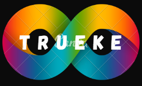

<h1>Trueke</h1>

 

<h2>Descripcion:</h2>

Trueke es una plataforma en línea dedicada a fomentar el intercambio de bienes y objetos que ya no se utilizan en tu comunidad. Nuestra misión es proporcionar una solución sencilla y efectiva para reducir el desperdicio, promover la sostenibilidad y construir una red de personas que valoren el intercambio y la reutilización 

<h3>Integrantes</h3>

- Maleydi Achicue
- Diego Arenas
- Valentina Calderon

<h6>A passionate developer Web  from Colombia</h6>

  

<h3>Connect with me:</h3>

<h3>Languages and Tools:</h3>

 

  

 
 
  

